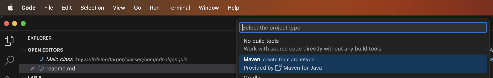
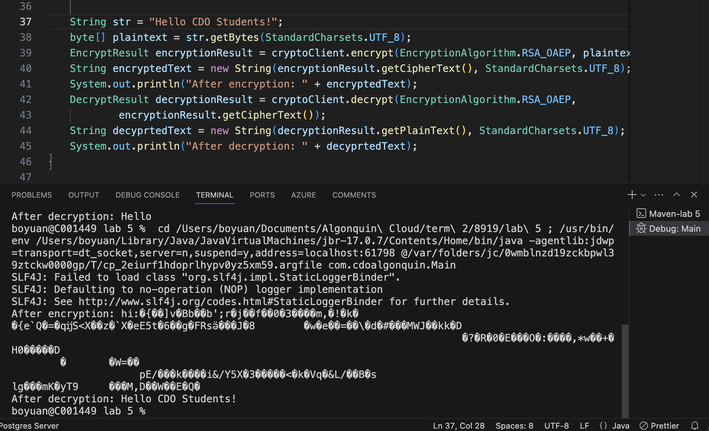

# 8919 Lab 5 Implementing Encryption and Key Management with Azure Key Vault


## Step 1, Create a key vault used by this lab. 

* 1.1 Create a resource group called "8919lab5" 


* 1.2 Create a key vault in the resource group created above. 

The premium pricing tier was selected because it provides more symmetric key algorithms. 


* 1.3 Create an RSA key


## Step 2, Initialize a java project backed by Maven. 

* 2.1 Open VS Code and use "Cmd + Shift + P" to invoke new project template

* 2.2 Enter "java" to select a java project


* 2.3 Select "Maven" as build tool. 



* 2.4 Select "No Archetype". 


* 2.5 Add dependencies in maven's pom.xml file to include azure sdk. 

```
 <dependencyManagement>
    
        <dependencies>
         <dependency>
            <groupId>com.azure</groupId>
            <artifactId>azure-sdk-bom</artifactId>
            <version>1.2.19</version>
            <type>pom</type>
            <scope>import</scope>
        </dependency>
        </dependencies>
    </dependencyManagement>
    <dependencies>
            <dependency>
                <groupId>com.azure</groupId>
                <artifactId>azure-security-keyvault-keys</artifactId>
            </dependency>
            <dependency>
                <groupId>com.azure</groupId>
                <artifactId>azure-security-keyvault-secrets</artifactId>
            </dependency>
            <dependency>
                <groupId>com.azure</groupId>
                <artifactId>azure-identity</artifactId>
            </dependency>
    </dependencies>
```


* 2.6 Create a KeyClient object with the name of the key and the URL of the key vault.
```
        String keyVaultUrl = "https://kvlab5yuan0037.vault.azure.net/";
        String keyName = "lab5key";

        // Create a KeyClient instance to interact with Azure Key Vault
        KeyClient keyClient = new KeyClientBuilder()
                .vaultUrl(keyVaultUrl)
                .credential(new DefaultAzureCredentialBuilder().build())
                .buildClient();
```
* 2.7 Create a Key object with the name of the key.

```
// Retrieve the RSA key from Azure Key Vault
        KeyVaultKey key = keyClient.getKey(keyName);
```

* 2.8 Create a CryptographyClient object with the Key object created in the former step
```
// Create a CryptographyClient instance to interact with Azure Key Vault
        CryptographyClient cryptoClient = new CryptographyClientBuilder()
                .credential(new DefaultAzureCredentialBuilder().build())
                .keyIdentifier(key.getId())
                .buildClient();
```

* 2.9 Encrypt a string
```
        String str = "Hello!";
            byte[] plaintext = str.getBytes(StandardCharsets.UTF_8);
        EncryptResult encryptionResult = cryptoClient.encrypt(EncryptionAlgorithm.RSA_OAEP, plaintext);
        String encryptedText = new String(encryptionResult.getCipherText(), StandardCharsets.UTF_8);
        System.out.println("After encryption: " + encryptedText);        
```
* 2.10 Decrypt the encrypted string
```
        DecryptResult decryptionResult = cryptoClient.decrypt(EncryptionAlgorithm.RSA_OAEP,
                encryptionResult.getCipherText());
        String decyprtedText = new String(decryptionResult.getPlainText(), StandardCharsets.UTF_8);
        System.out.println(decyprtedText);
```

## Step 3, Run and verify the decrypted string


Change the original string and see if the decrypted string is matching the original string. 


## References
[Msmbaldwin. (n.d.). Quickstart - Azure Key Vault Secret Client Library for java. Quickstart - Azure Key Vault Secret client library for Java | Microsoft Learn. https://learn.microsoft.com/en-us/azure/key-vault/secrets/quick-create-java?tabs=azure-cli ](https://learn.microsoft.com/en-us/azure/key-vault/secrets/quick-create-java?tabs=azure-cli)
